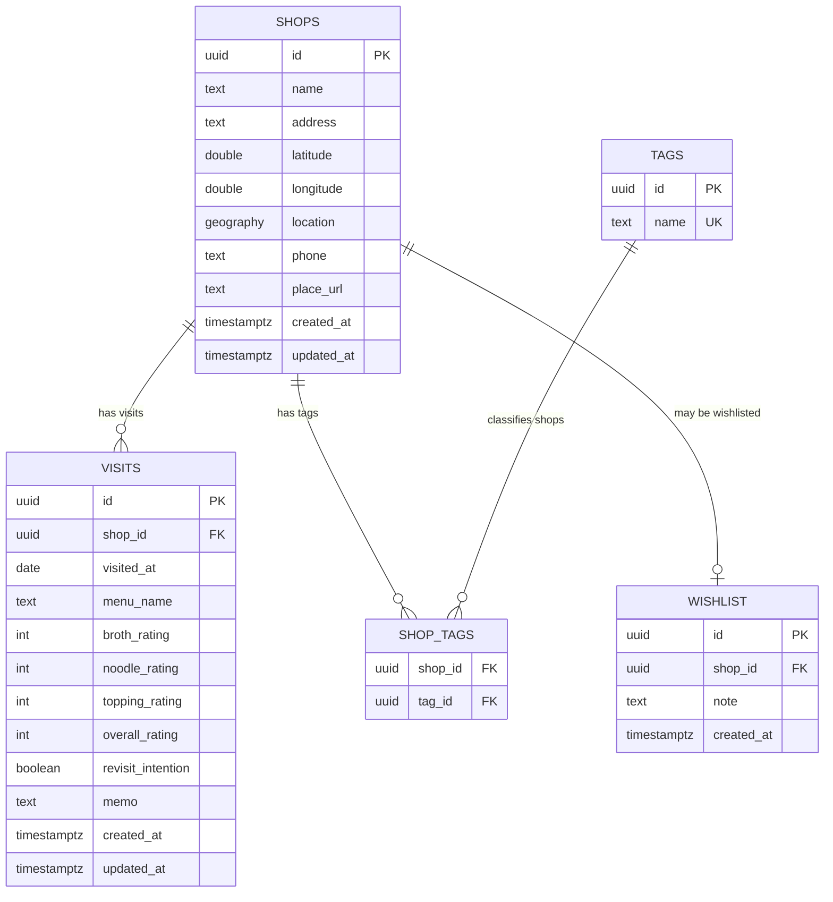
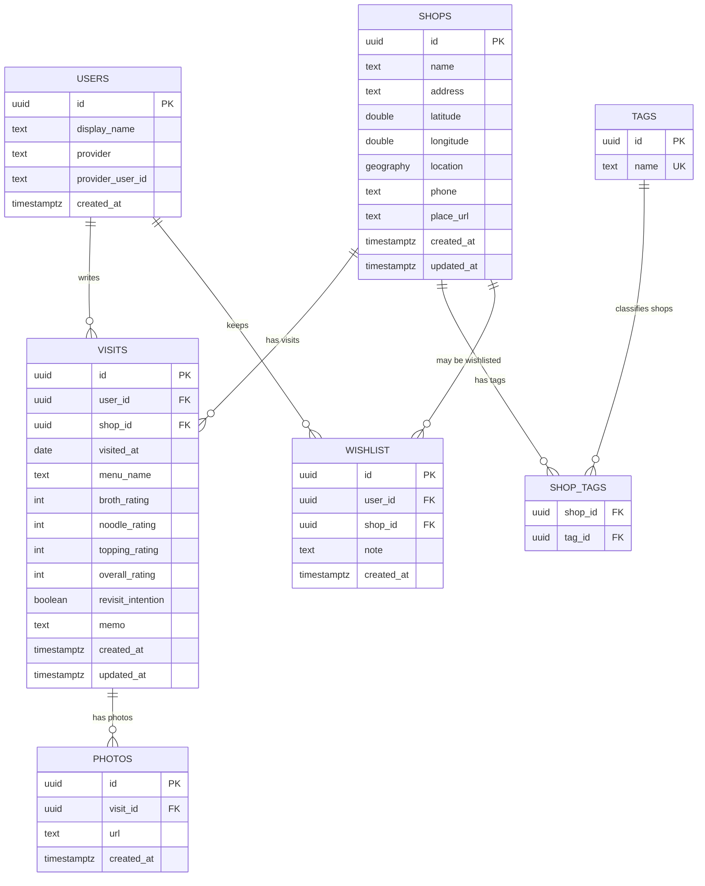

# Database ERD

DB 설계가 API DTO보다 먼저다. 이 문서는 테이블 관계와 확장 방향을 먼저 고정하고, API DTO는 이 모델을 외부에 드러내기 좋은 형태로 변환한다.

## 설계 원칙

- 라멘집은 장소의 기준 데이터다.
- 방문 기록은 라멘집에 여러 개 붙을 수 있다.
- 위시리스트는 라멘집 자체가 아니라 “가고 싶다”는 의도를 표현한다.
- 태그는 라멘집과 다대다 관계다.
- 도장깨기 통계는 초기에는 별도 테이블로 저장하지 않고 방문 기록에서 계산한다.
- 인증 도입 전까지는 사용자 소유권을 DB에 강하게 묶지 않는다. 다만 확장 설계에서는 `users`와 연결될 수 있게 둔다.

## MVP ERD

아래 ERD가 현재 1차 migration의 기준이다.

## 확장 ERD

인증, 사진, 지도 도장깨기 통계가 들어오면 아래 방향으로 확장한다. 이 테이블들은 아직 MVP migration에는 포함하지 않는다.

## 관계 규칙

### shops → visits

- 한 라멘집은 0개 이상의 방문 기록을 가진다.
- 방문 기록은 반드시 하나의 라멘집에 속한다.
- 라멘집 삭제 시 방문 기록도 삭제한다. MVP에서는 개인 기록장이므로 단순 cascade를 선택한다.

### shops ↔ tags

- 한 라멘집은 여러 태그를 가질 수 있다.
- 한 태그는 여러 라멘집에 붙을 수 있다.
- 태그 이름은 전역 unique로 둔다.

### shops → wishlist

- MVP에서는 한 라멘집당 위시리스트 항목을 최대 1개로 둔다.
- 인증 도입 후에는 `(user_id, shop_id)` unique로 바꾼다.
- 위시리스트는 방문 여부와 독립적이다. 이미 방문한 라멘집도 다시 가고 싶다면 위시리스트에 남을 수 있다.

### visits → photos, future

- 사진은 방문 기록에 붙는다.
- 사진 저장소는 DB가 아니라 외부 object storage가 될 수 있으므로 DB에는 URL과 메타데이터만 저장한다.

## DTO 설계 기준

API DTO는 테이블을 그대로 노출하지 않는다.

- `ShopResponse`는 `shops` 기본 필드에 계산값 `visited`, `wishlisted`, `averageRating`, `tags`를 포함한다.
- `VisitResponse`는 방문 기록 화면에 필요한 `shopName`을 포함한다.
- `CreateShopRequest`와 `UpdateShopRequest`는 태그 연결을 위해 `tagNames`를 받는다.
- `WishlistResponse`는 위시리스트 목록 표시를 위해 `shopName`을 포함한다.
- 위치 검색 DTO는 PostGIS 활용 시점에 추가한다.

## 아직 결정하지 않은 것

- 인증을 늦추더라도 `users` 테이블과 nullable `user_id`를 MVP schema에 미리 넣을지.
- 라멘집 데이터가 전역 공용인지, 사용자별 개인 장소인지.
- 위시리스트를 “가고 싶은 곳”만 의미하게 할지, “다시 가고 싶은 곳”까지 포함할지.
- 사진을 MVP 직후 바로 붙일지, 지도 기능 이후로 미룰지.

