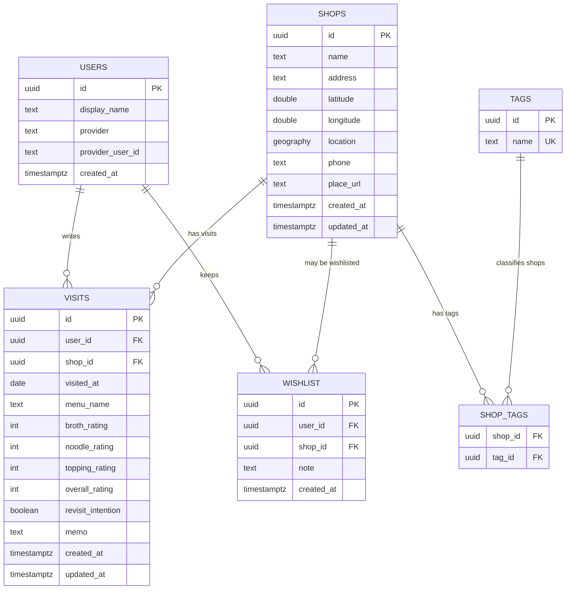
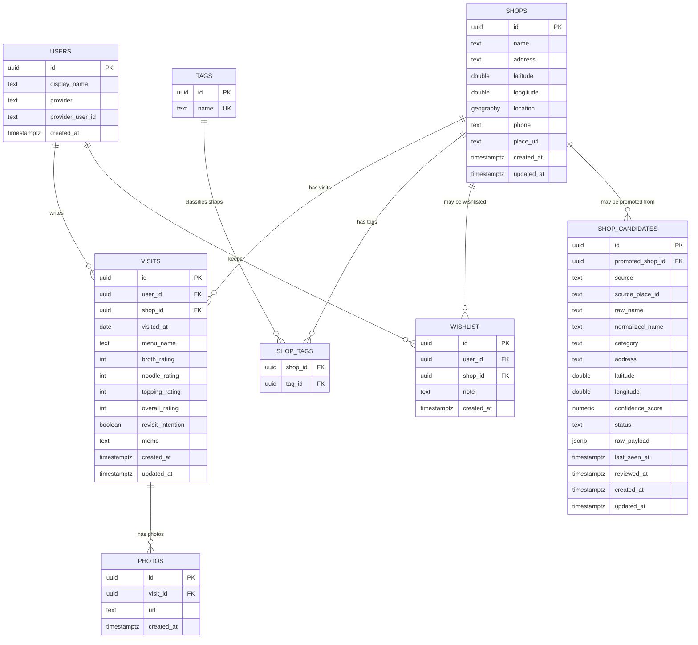

# Database ERD

DB 설계가 API DTO보다 먼저다. 이 문서는 테이블 관계와 확장 방향을 먼저 고정하고, API DTO는 이 모델을 외부에 드러내기 좋은 형태로 변환한다.

## 설계 원칙

- 라멘집은 장소의 기준 데이터다.
- 라멘집 후보는 외부 검색 API나 사용자 제보로 들어온 검수 전 데이터다.
- 서비스 검색 결과에는 검수된 라멘집만 노출한다.
- 방문 기록은 라멘집에 여러 개 붙을 수 있다.
- 위시리스트는 라멘집 자체가 아니라 “가고 싶다”는 의도를 표현한다.
- 태그는 라멘집과 다대다 관계다.
- 사용자는 방문 기록과 위시리스트의 소유자다.
- 도장깨기 통계는 초기에는 별도 테이블로 저장하지 않고 사용자별 방문 기록에서 계산한다.
- 서버 기반 서비스이므로 다중 사용자 모델을 전제로 둔다. 로그인 구현 시점은 별도 작업으로 자르더라도 DB 설계에서는 사용자 소유권을 고려한다.

## MVP ERD

아래 ERD가 제품 기준 MVP 모델이다. 현재 1차 migration은 인증 없는 선행 스캐폴드라 `users`, `user_id`를 아직 반영하지 않았다.

## 확장 ERD

외부 검색 후보 보강, 사진, 지도 도장깨기 통계가 들어오면 아래 방향으로 확장한다. 사용자 모델은 MVP 모델에 포함하고, 사진과 라멘집 후보는 아직 MVP migration에는 포함하지 않는다.

## 관계 규칙

### shops → visits

- 한 라멘집은 0개 이상의 방문 기록을 가진다.
- 방문 기록은 반드시 하나의 라멘집에 속한다.
- 방문 기록은 반드시 하나의 사용자에게 속한다.
- 라멘집 삭제 시 방문 기록도 삭제한다. 초기에는 단순 cascade를 선택하되, 운영 데이터가 쌓이면 삭제 대신 soft delete를 검토한다.

### shop_candidates → shops

- 외부 검색 API와 사용자 제보는 `shops`에 바로 넣지 않고 `shop_candidates`에 먼저 저장한다.
- 서비스 기본 검색 결과에는 `shops`만 사용한다.
- `shop_candidates.status`는 최소 `pending`, `rejected`, `promoted`를 가진다.
- 검수 후 라멘집으로 인정되면 `shops`에 승격하고 `promoted_shop_id`로 연결한다.
- 같은 외부 장소의 중복 저장을 줄이기 위해 `(source, source_place_id)` unique를 둔다. 외부 ID가 없거나 불안정한 경우 `normalized_name + address` 기준 중복 탐지를 보조로 사용한다.
- `raw_payload`는 외부 응답 원본을 보관해 나중에 필드 매핑을 다시 판단할 수 있게 한다.
- cron 또는 scheduled job은 `shop_candidates`를 보강할 수 있지만, 검수 없이 `shops`를 직접 변경하지 않는다.

### shops ↔ tags

- 한 라멘집은 여러 태그를 가질 수 있다.
- 한 태그는 여러 라멘집에 붙을 수 있다.
- 태그 이름은 전역 unique로 둔다.

### shops → wishlist

- MVP에서는 사용자와 라멘집 조합당 위시리스트 항목을 최대 1개로 둔다.
- `(user_id, shop_id)` unique를 둔다.
- 위시리스트는 방문 여부와 독립적이다. 이미 방문한 라멘집도 다시 가고 싶다면 위시리스트에 남을 수 있다.

### visits → photos, future

- 사진은 방문 기록에 붙는다.
- 사진 저장소는 DB가 아니라 외부 object storage가 될 수 있으므로 DB에는 URL과 메타데이터만 저장한다.

## DTO 설계 기준

API DTO는 테이블을 그대로 노출하지 않는다.

- `ShopResponse`는 `shops` 기본 필드에 계산값 `visited`, `wishlisted`, `averageRating`, `tags`를 포함한다.
- `VisitResponse`는 방문 기록 화면에 필요한 `shopName`을 포함한다.
- `CreateShopRequest`와 `UpdateShopRequest`는 태그 연결을 위해 `tagNames`를 받는다.
- `WishlistResponse`는 위시리스트 목록 표시를 위해 `shopName`을 포함한다.
- 로그인 이후 `visited`, `wishlisted`, `averageRating`은 현재 사용자 기준으로 계산한다.
- 위치 검색 DTO는 PostGIS 활용 시점에 추가한다.

## 아직 결정하지 않은 것

- 라멘집 데이터가 전역 공용인지, 사용자별 개인 장소인지.
- 위시리스트를 “가고 싶은 곳”만 의미하게 할지, “다시 가고 싶은 곳”까지 포함할지.
- OAuth 제공자를 무엇으로 시작할지. 후보: Google, Kakao, Naver.
- 인증 전 개발 편의를 위해 임시 dev user를 둘지.
- 사진을 MVP 직후 바로 붙일지, 지도 기능 이후로 미룰지.
