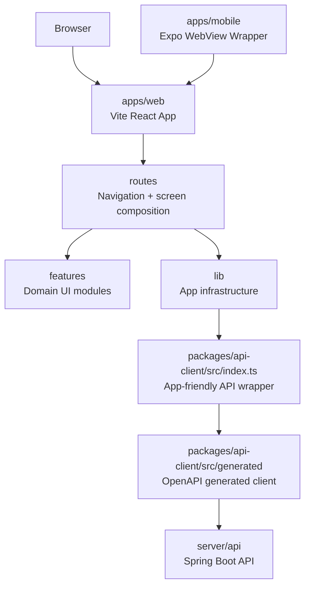

# Frontend Module Structure

프론트는 Vite React 앱, Expo React Native WebView wrapper, API client package로 시작한다. Android 프로젝트에 빗대면 `apps/web`과 `apps/mobile`은 각각 `:app:web`, `:app:mobile`, `packages/api-client`는 `:core:network` 또는 `:core:api-contract`에 가깝다.

현재는 별도 npm package를 많이 쪼개지 않는다. 대신 앱 내부를 `routes`, `features`, `lib`로 나눠서 화면 조립, 기능 UI, 앱 공통 인프라를 분리한다.

## 현재 구조

```text
apps/web/
  src/
    main.tsx
    routes/
      index.tsx
      shops.index.tsx
      shops.$shopId.tsx
      visits.$visitId.tsx
      about.tsx
    features/
      shops/
        ShopCard.tsx
        ShopForm.tsx
      visits/
        VisitCard.tsx
        VisitForm.tsx
    lib/
      api.ts
      queryClient.ts
    styles.css

apps/mobile/
  app.json
  index.ts
  src/
    App.tsx
    config.ts

packages/api-client/
  src/
    generated/
    index.ts
```

## 구조도



## 각 영역의 책임

### `routes`

라우팅과 화면 조립을 담당한다.

역할:

- URL과 화면을 연결한다.
- page-level query/mutation 흐름을 배치한다.
- 여러 feature module을 조립한다.
- TanStack Router의 params/search params를 다룬다.

넣지 않을 것:

- 라멘집 카드의 세부 UI
- 방문 기록 폼 내부 상태
- fetch 세부 구현
- DTO 수동 정의

Android 비유:

```text
navigation graph + screen entrypoint
```

### `features`

도메인별 UI module이다. 현재는 `shops`, `visits`가 있다.

역할:

- 특정 도메인 화면 조각을 렌더링한다.
- form state처럼 화면 가까이에 있는 UI state를 관리한다.
- props로 받은 데이터와 callback을 사용한다.

넣지 않을 것:

- 전역 query client 설정
- API base URL 설정
- OpenAPI generated client 직접 호출
- 다른 feature의 내부 구현 의존

Android 비유:

```text
:feature:shops
:feature:visits
```

단, 지금은 npm package로 쪼개지 않고 `apps/web/src/features/*` 폴더로만 둔다. package 분리는 import 경계가 진짜로 필요해질 때 한다.

### `lib`

앱 공통 인프라 module이다.

현재 파일:

```text
lib/api.ts
lib/queryClient.ts
```

역할:

- API client instance 생성
- TanStack Query client 생성
- 앱 전체에서 한 번 정해지는 설정 관리

Android 비유:

```text
:core:network
:core:common
```

### `packages/api-client`

서버 OpenAPI 계약을 TypeScript로 가져오는 package다.

구조:

```text
src/generated  OpenAPI Generator 산출물
src/index.ts   앱에서 쓰기 좋은 wrapper
```

규칙:

- `src/generated`는 직접 수정하지 않는다.
- 서버 DTO 또는 controller annotation을 수정한 뒤 `pnpm api:generate`로 다시 만든다.
- generated client의 `Date`, optional field 같은 표현 차이는 `src/index.ts`에서 앱 타입으로 변환한다.

Android 비유:

```text
:core:api-contract
```

### `apps/mobile`

웹 앱을 네이티브 shell 안에서 띄우는 React Native wrapper app이다.

역할:

- `nitro-webview`로 `apps/web` 배포 URL 또는 로컬 개발 URL을 렌더링한다.
- reload, loading, error fallback 같은 wrapper-level UX를 제공한다.
- 나중에 push notification, native auth callback, app store 배포 설정을 붙일 수 있는 자리를 만든다.

넣지 않을 것:

- 웹 앱과 중복되는 CRUD 화면
- 서버 DTO 수동 정의
- `packages/api-client` 직접 호출

Android 비유:

```text
:app:mobile
```

## 의존 방향

의존은 아래 방향으로만 흐른다.

```text
routes -> features
routes -> lib
lib -> packages/api-client
packages/api-client -> generated OpenAPI client
```

피해야 할 방향:

```text
features -> routes
features -> generated client
packages/api-client -> apps/web
```

이 방향을 지키면 feature UI는 라우터와 네트워크 구현에서 비교적 자유로워진다.

## Module interface 기준

`codebase-design` 기준으로 module은 “폴더”가 아니라 interface와 implementation을 가진 단위다.

현재 중요한 interface:

- `createRamenApiClient(baseUrl)`: 프론트가 서버와 통신하는 작은 interface
- `ShopCard`, `ShopForm`, `VisitCard`, `VisitForm`: props가 UI module의 interface
- route file: URL params와 화면 조립 방식이 interface

좋은 module의 목표:

- caller가 알아야 할 것이 적다.
- 내부 구현 변경이 caller로 번지지 않는다.
- 테스트할 때 같은 interface를 통과할 수 있다.

## 언제 package로 분리할까

지금은 `features/*`를 별도 package로 만들지 않는다. 다음 조건이 생기면 분리를 검토한다.

- web과 admin이 같은 feature UI를 공유한다.
- mobile/webview에서도 같은 UI나 state holder를 재사용한다.
- feature 간 import 규칙을 tooling으로 강제해야 한다.
- 하나의 package build/test만 따로 돌릴 필요가 커진다.

예상 확장:

```text
apps/
  web/
  mobile/
  admin/
packages/
  api-client/
  ui/
  feature-shops/
  feature-visits/
```

하지만 지금 단계에서는 package 수를 늘리면 설정과 빌드 비용이 더 커진다. 폴더 구조로 시작하고, 실제 재사용과 독립 검증 필요가 생길 때 package로 승격한다.

## 다음 정리 후보

- feature별 query/mutation wrapper 추가
- route file에서 API 호출 흐름을 더 얇게 만들기
- `packages/ui`가 필요해질지 디자인 반복 후 판단
- 지도 기능이 들어올 때 `features/map`과 map 전용 lib를 분리
