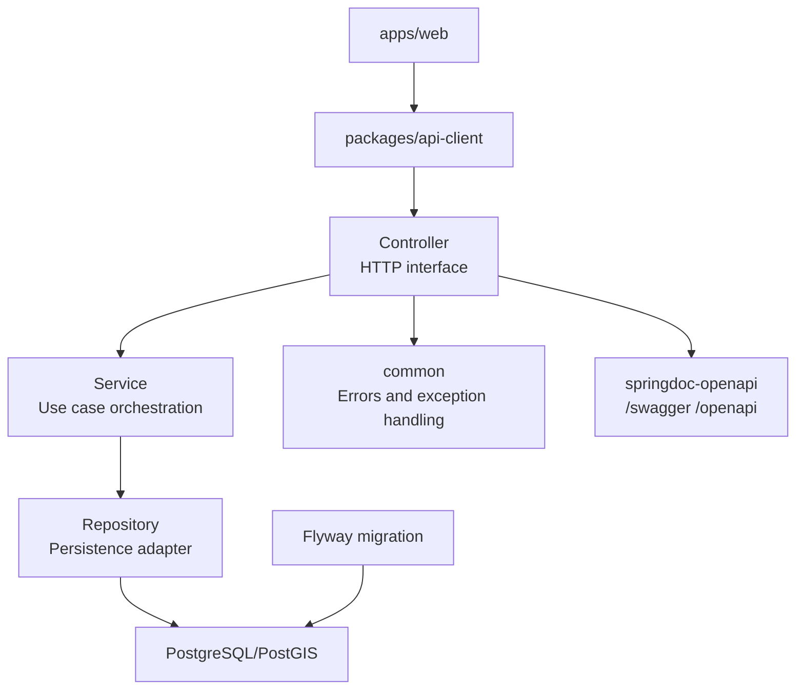

# Backend Module Structure

백엔드는 현재 단일 Spring Boot Gradle module 안에서 도메인별 package로 나눈 구조다. Android 멀티모듈 프로젝트처럼 Gradle module을 여러 개로 쪼개지는 않았다.

이유는 아직 API 규모가 작고, `shops`, `visits`, `wishlist`가 한 DB transaction boundary 안에서 함께 움직이기 때문이다. 지금은 물리적 multi-module보다 package별 책임 분리가 더 가볍고 빠르다.

## 현재 구조

```text
server/api/
  build.gradle.kts
  src/main/kotlin/com/ramendojang/
    ApiApplication.kt
    OpenApiConfig.kt
    HealthController.kt
    HealthResponse.kt
    common/
      ApiException.kt
      ErrorResponse.kt
      GlobalExceptionHandler.kt
    shop/
      ShopController.kt
      ShopService.kt
      ShopRepository.kt
      ShopRecord.kt
      dto/
    visit/
      VisitController.kt
      VisitService.kt
      VisitRepository.kt
      dto/
    wishlist/
      WishlistController.kt
      WishlistService.kt
      WishlistRepository.kt
      dto/
  src/main/resources/
    application.properties
    db/migration/
      V1__create_initial_schema.sql
```

## 구조도



## Domain package 기준

백엔드는 기술 계층별 package보다 도메인별 package를 우선한다.

현재:

```text
shop/
visit/
wishlist/
common/
```

선호하는 확장:

```text
auth/
user/
shop/
visit/
wishlist/
stamp/
common/
```

피하고 싶은 구조:

```text
controller/
service/
repository/
dto/
```

기술 계층 기준으로만 나누면 라멘집 작업을 할 때 여러 package를 계속 오가야 한다. 도메인별 package는 관련 변경의 locality가 좋다.

## 각 영역의 책임

### Controller

HTTP interface adapter다.

역할:

- URL, method, status code를 정의한다.
- request DTO validation을 받는다.
- response DTO를 반환한다.
- Swagger/OpenAPI annotation을 갖는다.

넣지 않을 것:

- SQL
- 복잡한 domain rule
- transaction 세부 흐름
- generated TypeScript client 고려로 인한 임시 로직

### DTO

외부 API 계약이다.

역할:

- request/response shape 정의
- validation annotation
- Swagger schema/example

규칙:

- DB table을 그대로 노출하지 않는다.
- 이름은 `CreateShopRequest`, `ShopResponse`처럼 명확히 한다.
- API 변경 시 OpenAPI client를 다시 생성한다.

### Service

use case module이다.

역할:

- 한 요청에서 필요한 domain 흐름을 조합한다.
- repository 호출 순서를 결정한다.
- not found, validation 외 business error를 결정한다.
- transaction boundary 후보가 된다.

현재는 작은 CRUD 중심이라 얇을 수 있다. 다만 controller가 repository를 직접 알지 않게 하는 interface 역할을 한다.

### Repository

DB persistence adapter다.

역할:

- SQL 작성
- row mapping
- insert/update/delete/query
- PostGIS query는 여기에 둔다.

넣지 않을 것:

- HTTP status code
- Swagger annotation
- 화면 전용 계산

### Record

DB row에 가까운 내부 model이다.

역할:

- repository가 DB에서 읽어온 값을 service로 넘긴다.
- 외부 response DTO와 구분한다.

규칙:

- `Record`는 API 계약이 아니다.
- controller 밖으로 직접 내보내지 않는다.

### common

공통 error와 exception handling module이다.

역할:

- `ApiException`
- `ErrorResponse`
- `GlobalExceptionHandler`

공통이라는 이름으로 비즈니스 로직을 모으지 않는다. 여러 도메인이 진짜로 공유하는 cross-cutting concern만 둔다.

## 의존 방향

선호 방향:

```text
Controller -> Service -> Repository -> DB
Controller -> DTO
Service -> DTO 또는 내부 model
Repository -> Record
GlobalExceptionHandler -> ErrorResponse
```

피해야 할 방향:

```text
Repository -> Controller
Repository -> HTTP DTO
Service -> Spring Web response type
common -> shop/visit/wishlist
```

## Android 멀티모듈과 비교

현재 구조를 Android식으로 억지 매핑하면 아래와 비슷하다.

```text
server/api                    :app 또는 :server:api
com.ramendojang.shop          :feature:shop package
com.ramendojang.visit         :feature:visit package
com.ramendojang.wishlist      :feature:wishlist package
com.ramendojang.common        :core:common package
db/migration                  :data:schema 역할
```

하지만 실제 Gradle module은 아직 하나다.

```text
server/api
```

## 언제 Gradle multi-module로 나눌까

지금은 나누지 않는다. 다음 조건이 생기면 검토한다.

- 인증/domain logic을 API 서버 밖에서도 재사용한다.
- batch, worker, admin API가 같은 domain module을 공유한다.
- persistence adapter를 교체하거나 테스트 fake adapter가 많아진다.
- compile/test 시간이 커져서 module 단위 검증이 필요하다.
- dependency rule을 Gradle로 강제해야 한다.

가능한 미래 구조:

```text
server/
  api/          Spring Web entrypoint
  domain/       순수 domain/use case
  persistence/  JDBC/PostGIS adapter
  auth/         security/auth adapter
```

또는 더 Android스럽게:

```text
server/
  app/
  core/common/
  core/database/
  feature/shop/
  feature/visit/
  feature/wishlist/
```

다만 이 단계에서 쪼개면 얻는 것보다 build 설정, dependency wiring, 테스트 설정 비용이 더 크다. 먼저 package 구조로 locality를 확보하고, 진짜 독립 배포/검증 필요가 생기면 Gradle module로 승격한다.

## 다음 정리 후보

- 로그인 도입 전에 `user` 또는 `auth` package 설계
- user ownership 반영 후 service transaction boundary 재검토
- repository test 추가 시 DB test fixture 위치 정리
- Swagger smoke test를 만들면 API contract 검증 위치 정리
