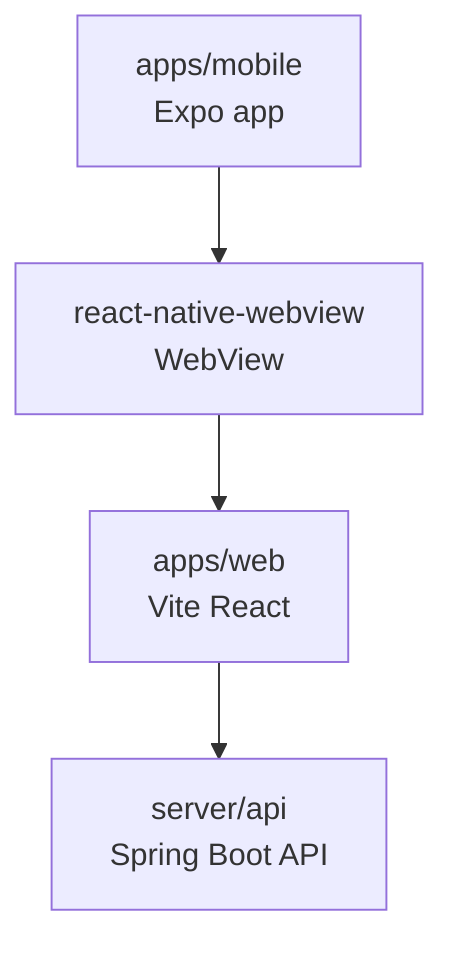

# Mobile WebView Wrapper

> 현재 제품 1차 목표가 웹사이트 + 토스 미니앱 출시로 바뀌었으므로 이 문서는 보류된 대안 기록이다. 앱인토스 출시는 `apps/web`을 Granite/TDS로 연동하면 되며, `apps/mobile`은 앱스토어/플레이스토어 출시가 다시 목표가 되기 전까지 확장하지 않는다.

서비스의 현재 1차 목표는 웹사이트 + 토스 미니앱이다. 앱인토스 자체가 웹 기반 미니앱을 실행하므로 ~~Nitro WebView~~로 다시 감쌀 필요는 없다. `apps/mobile`은 별도 스토어 앱 배포가 필요해질 때 같은 웹 앱을 React Native WebView로 감싸 제공하기 위한 보류된 대안이다.

앱스토어/플레이스토어 배포, push notification, native auth callback 같은 모바일 shell 기능이 토스 미니앱으로 해결되지 않을 때만 이 wrapper를 확장한다.

## 현재 선택

```text
apps/mobile
  Expo React Native app
  react-native-webview
```

보류한 선택지: ~~`expo-dev-client`~~, ~~`nitro-webview`~~, ~~`react-native-nitro-modules`~~

왜 Expo인가:

- 초기 React Native 앱 스캐폴드와 실행 흐름이 가볍다.
- iOS/Android 설정을 `app.json` 중심으로 시작할 수 있다.
- 나중에 EAS build로 app store 배포 흐름을 붙이기 쉽다.

왜 `react-native-webview`인가:

- WebView는 navigation, loading, message, error, download 같은 event가 많다.
- Expo Go로 실기기 UX를 빠르게 확인할 수 있다.
- page-side `window.ReactNativeWebView.postMessage(...)` 계약은 유지한다.
- 기존 WebView와 비슷한 `source`, `onLoadStart`, `onLoadEnd`, `onMessage`, `onError` 개념을 유지한다.

## 구조

```text
apps/mobile/
  app.json
  package.json
  index.ts
  src/
    App.tsx
    config.ts
    env.d.ts
```



## 실행

웹 서버를 먼저 띄운다.

```bash
pnpm dev:web
```

모바일 wrapper를 실행한다.

```bash
pnpm dev:mobile
```

실기기에서 로컬 웹 서버를 볼 때는 `localhost` 대신 컴퓨터의 LAN 주소를 쓴다.

```text
EXPO_PUBLIC_WEB_URL=http://192.168.x.x:5173
```

폰과 개발 컴퓨터는 같은 Wi-Fi/LAN에 있어야 한다. 셀룰러, VPN, 게스트 Wi-Fi처럼 네트워크가 갈라지면 `192.168.x.x` 주소가 열리지 않는다. 먼저 폰 브라우저에서 `EXPO_PUBLIC_WEB_URL`과 `http://192.168.x.x:8080/health`를 직접 열어본다.

## Expo 호환성 기준

현재 기준은 Expo SDK 56 + React Native 0.85.3 + React 19.2.3이다. Expo SDK 55 이후는 New Architecture가 항상 켜져 있으므로 `app.json`에 `newArchEnabled`를 따로 두지 않는다.

현재는 Expo Go smoke test를 위해 `react-native-webview`를 쓴다. 나중에 Expo Go에 없는 native module, push notification, store build 검증이 필요해지면 ~~`expo-dev-client`~~ 같은 development build 흐름 또는 `expo prebuild` 이후 native build로 전환한다.

현재 로컬 검증:

```bash
cd apps/mobile
pnpm dlx expo-doctor@latest
```

결과:

```text
21/21 checks passed. No issues detected.
```

이 결과는 Expo SDK 버전 조합과 app config schema가 맞다는 뜻이다. iOS/Android native build, WebView 실제 로딩, file upload/download 동작까지 보장하지는 않는다.

## 주의점

- Expo Go 확인은 로컬 UX smoke test 용도다.
- iOS/Android store build 확인은 development build 또는 `expo run:ios`, `expo run:android` 기반으로 한다.
- file upload를 쓰려면 iOS camera/photo/microphone permission string과 Android media permission을 확인해야 한다.
- 지금 단계에서는 `ios/`, `android/` native output을 git에 커밋하지 않는다. prebuild 후 native 설정이 안정되면 별도 커밋으로 판단한다.

## 다음 작업

- `pnpm --filter mobile typecheck`
- `pnpm dlx expo-doctor@latest`
- iOS development build에서 기본 WebView load 확인
- Android development build에서 기본 WebView load 확인
- file upload/download이 필요해지는 시점에 native host 설정 검증

## 참고

- ~~[nitro-webview](https://github.com/l2hyunwoo/nitro-webview)~~
- ~~[Nitro Modules](https://github.com/mrousavy/nitro)~~
- [Expo New Architecture](https://docs.expo.dev/guides/new-architecture/)
- [Expo development builds](https://docs.expo.dev/develop/development-builds/introduction/)
