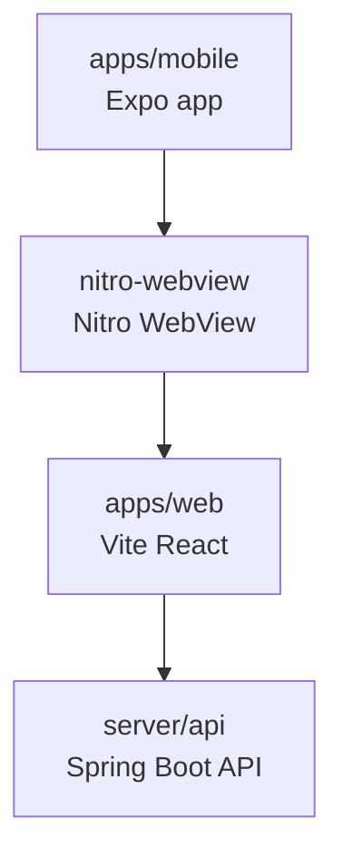

# Mobile WebView Wrapper

모바일 앱은 처음부터 별도 native 화면을 만들지 않고, `apps/web`을 감싸는 React Native WebView wrapper로 시작한다. 앱스토어 배포, push notification, native auth callback 같은 모바일 shell 기능이 필요해질 때 이 앱을 확장한다.

## 현재 선택

```text
apps/mobile
  Expo React Native app
  nitro-webview
  react-native-nitro-modules
```

왜 Expo인가:

- 초기 React Native 앱 스캐폴드와 실행 흐름이 가볍다.
- iOS/Android 설정을 `app.json` 중심으로 시작할 수 있다.
- 나중에 EAS build로 app store 배포 흐름을 붙이기 쉽다.

왜 `nitro-webview`인가:

- WebView는 navigation, loading, message, error, download 같은 event가 많다.
- `nitro-webview`는 Nitro Modules 기반이라 legacy bridge의 JSON serialization과 event emitter round-trip을 줄이는 방향이다.
- page-side `window.ReactNativeWebView.postMessage(...)` 계약은 유지한다.
- 기존 WebView와 비슷한 `source`, `onLoadStart`, `onLoadEnd`, `onMessage`, `onError` 개념을 유지한다.
- imperative method는 hybrid ref로 받는다. 이건 Nitro 방식의 명확한 차이다.

## 구조

```text
apps/mobile/
  app.json
  package.json
  index.ts
  src/
    App.tsx
    config.ts
    env.d.ts
```



## 실행

웹 서버를 먼저 띄운다.

```bash
pnpm dev:web
```

모바일 wrapper를 실행한다.

```bash
pnpm dev:mobile
```

실기기에서 로컬 웹 서버를 볼 때는 `localhost` 대신 컴퓨터의 LAN 주소를 쓴다.

```text
EXPO_PUBLIC_WEB_URL=http://192.168.x.x:5173
```

## Nitro 사용 시 코드 규칙

`nitro-webview`의 event prop은 raw function이 아니라 `callback(...)`으로 감싼다.

```tsx
import { NitroWebView, callback } from "nitro-webview";

<NitroWebView
  source={{ uri: webUrl }}
  onLoadEnd={callback(() => setIsLoading(false))}
/>
```

imperative method는 React `ref`가 아니라 `hybridRef`로 받는다.

```tsx
const webViewRef = useRef<NitroWebViewType | null>(null);

<NitroWebView
  hybridRef={callback((ref) => {
    webViewRef.current = ref;
  })}
/>
```

## 주의점

- Nitro native module을 쓰므로 Expo Go만으로는 부족할 수 있다.
- iOS/Android 확인은 development build 또는 `expo run:ios`, `expo run:android` 기반으로 한다.
- `nitro-webview`의 Android file download 지원은 Mozilla Maven repository 설정이 필요할 수 있다.
- file upload를 쓰려면 iOS camera/photo/microphone permission string과 Android media permission을 확인해야 한다.
- 지금 단계에서는 `ios/`, `android/` native output을 git에 커밋하지 않는다. prebuild 후 native 설정이 안정되면 별도 커밋으로 판단한다.

## 다음 작업

- `pnpm --filter mobile typecheck`
- iOS development build에서 기본 WebView load 확인
- Android development build에서 기본 WebView load 확인
- file upload/download이 필요해지는 시점에 native host 설정 검증

## 참고

- [nitro-webview](https://github.com/l2hyunwoo/nitro-webview)
- [Nitro Modules](https://github.com/mrousavy/nitro)
- [Expo create a project](https://docs.expo.dev/get-started/create-a-project/)
