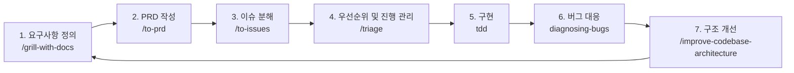

# Development Flow

이 프로젝트는 `mattpocock/skills` 계열 워크플로우를 기준으로 진행한다. 목표는 AI 에이전트가 단순 코딩 도구처럼 바로 구현부터 들어가지 않고, 질문하고 문서화하고 쪼개고 테스트하고 개선하는 엔지니어링 사이클을 따르게 하는 것이다.

## 기본 사이클



## 1. 요구사항 정의

사용 스킬:

- `/grill-with-docs`
- 필요 시 `domain-modeling`

목적:

- 애매한 요구사항을 질문으로 좁힌다.
- 도메인 언어와 결정 사항을 문서에 남긴다.
- DB/API 작업은 먼저 ERD와 데이터 소유권을 확인한다.

이 프로젝트에서 남길 문서:

- [제품 방향](01-product-overview.md)
- [DB ERD](06-database-erd.md)
- [LESSONS](LESSONS.md)
- 필요 시 ADR 성격의 결정 기록

## 2. PRD 작성

사용 스킬:

- `/to-prd`

목적:

- 대화 내용을 제품 요구사항 문서로 정리한다.
- 구현 전에 목표, 범위, 제외 범위, 검증 기준을 고정한다.

이 프로젝트에서 남길 문서:

- [제품 방향](01-product-overview.md)
- 필요 시 기능별 PRD 문서

## 3. 이슈 분해

사용 스킬:

- `/to-issues`

목적:

- PRD를 독립적으로 구현 가능한 작은 단위로 쪼갠다.
- 각 이슈가 public behavior와 검증 방법을 갖게 한다.

이 프로젝트에서 남길 문서:

- [TODO](TODO.md)
- 필요 시 GitHub issue

## 4. 우선순위 및 진행 관리

사용 스킬:

- `/triage`

목적:

- 작업 상태와 우선순위를 관리한다.
- 막힌 검증, 외부 환경 필요 사항, 다음 작업 후보를 분리한다.

이 프로젝트에서 남길 문서:

- [TODO](TODO.md)
- [WORKLOG](WORKLOG.md)
- [HANDOFF](HANDOFF.md)

## 5. 구현

사용 스킬:

- `tdd`
- 필요 시 `implement`
- 프론트 UI 작업은 `frontend-design`
- 과한 설계가 의심되면 `ponytail`

원칙:

- 기능 추가, 버그 수정, API 동작 변경은 TDD를 기본으로 한다.
- public interface와 behavior를 먼저 정한다.
- behavior 하나에 대해 실패 테스트를 먼저 만든다.
- 최소 구현으로 green을 만든다.
- 모든 테스트가 green일 때만 refactor한다.

현재 하네스:

```bash
pnpm verify
```

커밋 시점에는 [.githooks/pre-commit](../.githooks/pre-commit)이 같은 하네스를 실행한다.
세부 흐름도와 단계별 의미는 [Verification Harness](12-verification-harness.md)에 따로 둔다. 파일명에 `harness`가 들어가므로 하네스 관련 내용을 찾을 때는 이 문서를 먼저 본다.

주의:

- `pnpm verify`는 현재 가능한 검증 하네스다.
- 프론트 behavior test runner와 API smoke/integration test는 아직 보강 대상이다.
- 초기 scaffold는 TDD 흐름으로 구현되지 않았으므로 테스트 부채로 본다.

## 6. 버그 대응

사용 스킬:

- `diagnosing-bugs`

목적:

- 재현 → 최소화 → 가설 → 계측 → 수정 → 회귀 테스트 순서로 문제를 해결한다.
- 실패 원인을 추측으로 덮지 않고 증거를 남긴다.

이 프로젝트에서 남길 문서:

- [LESSONS](LESSONS.md)
- [TODO](TODO.md)
- 필요 시 regression test

## 7. 구조 개선

사용 스킬:

- `/improve-codebase-architecture`
- 필요 시 `codebase-design`
- 과한 추상화 제거는 `ponytail-review` 또는 `ponytail-audit`

목적:

- 구현이 쌓인 뒤 구조를 점검한다.
- 모듈 경계, 테스트 가능성, API client wrapper, 서버 package 구조를 개선한다.
- 개선은 기능 구현과 분리된 커밋으로 남긴다.

이 프로젝트에서 볼 문서:

- [프론트 모듈 구조](07-frontend-module-structure.md)
- [백엔드 모듈 구조](08-backend-module-structure.md)
- [기술 스택](10-tech-stack.md)

## 보조 스킬

| 스킬 | 사용 시점 |
| --- | --- |
| `/grill-me` | 비교군, 계획, 설계가 흐릿할 때 질문으로 좁힌다. |
| `/handoff` | 다른 에이전트나 새 세션에 작업을 넘길 때 요약한다. |
| `/teach` | 새 개념을 설명하고 [LESSONS](LESSONS.md)에 남길 때 사용한다. |
| `/writing-great-skills` | 새 스킬이나 작업 규칙을 만들 때 참고한다. |
| `/prototype` | 빠른 프로토타입으로 아이디어를 검증한다. |
| `scaffold-exercises` | 학습 자료나 반복 문제 구조가 필요할 때 사용한다. |
| `setup-pre-commit` | hook을 라이브러리 기반으로 확장할 때 참고한다. 현재 repo는 의존성 없는 `.githooks` 방식을 쓴다. |

## 현재 적용 상태

이미 적용한 것:

- 문서 기반 작업 규칙
- TODO/WORKLOG/LESSONS 기록 체계
- TDD 기준 문서화
- `pnpm verify` 검증 하네스
- `.githooks/pre-commit` 커밋 전 하네스
- commit-push 기준 작업 단위 커밋

아직 부채로 남은 것:

- 초기 scaffold/API/frontend 작업의 실제 TDD red-green-refactor 흔적 부족
- API behavior test 보강
- 프론트 query/mutation behavior test 전략 결정
- DB/Flyway 실환경 검증
- 모바일 development build 검증
