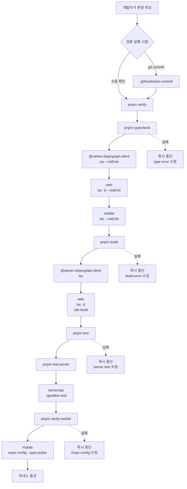

# Verification Harness

이 문서는 라멘 도장깨기 repo의 검증 하네스가 어떤 순서로 실행되는지 설명한다. “하네스”, “harness”, “pre-commit”, “pnpm verify”로 찾기 쉽게 별도 파일로 둔다.

## 현재 진입점

수동 검증:

```bash
pnpm verify
```

커밋 시점 검증:

```bash
.githooks/pre-commit
```

커밋할 때는 Git hook이 `.githooks/pre-commit`을 실행하고, 이 hook이 다시 `pnpm verify`를 실행한다. 즉 사람이 직접 실행하든 커밋을 하든 같은 하네스를 통과해야 한다.

## 흐름도

현재 하네스는 commit 전 hook과 수동 명령이 같은 진입점으로 모이도록 만든다. `set -e`와 `&&` 체인을 사용하므로 중간 단계가 실패하면 뒤 단계는 실행하지 않고 즉시 멈춘다.



## 단계별 의미

- `pnpm typecheck`: API client, web, mobile TypeScript 계약이 깨졌는지 확인한다.
- `pnpm build`: generated client package와 Vite web production build가 가능한지 확인한다.
- `pnpm test`: 현재는 서버 테스트 하네스로 연결되어 있다.
- `pnpm verify:mobile`: Expo app config가 SDK/schema 기준으로 해석되는지 확인한다.

## 아직 하네스에 없는 것

- 브라우저 기반 UI smoke/e2e 검증
- API smoke/integration test
- DB/Flyway 실환경 migration 검증
- 모바일 iOS/Android development build 검증
- lint trial 후 확정될 `pnpm lint`

## 관련 파일

- [package.json](../package.json)
- [.githooks/pre-commit](../.githooks/pre-commit)
- [Development Flow](11-development-flow.md)
- [AGENTS.md](../AGENTS.md)
