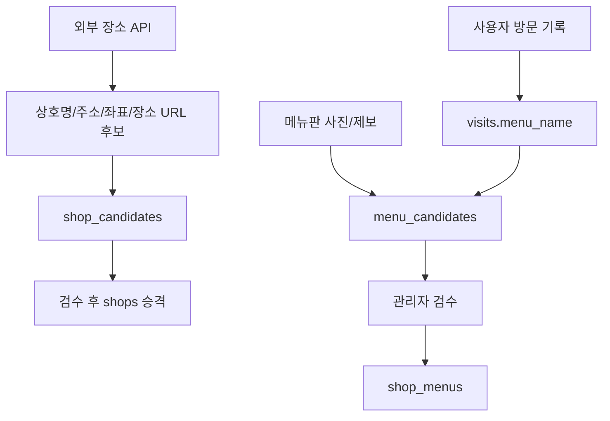

# Place Open API Data Research

조사일: 2026-06-26
추가 확인: 2026-07-07

이 문서는 라멘집 후보를 보강할 때 Naver, Kakao, Google 계열 공개 장소 API에서 가져올 수 있는 정보의 최대치를 정리한다. 결론은 단순하다. 장소 발견에는 쓸 수 있지만, 메뉴/가격/라멘 스타일을 자동으로 채우는 용도로는 부족하다.

## 결론

안정적으로 기대할 수 있는 최소 데이터:

- 상호명
- 주소 또는 도로명 주소
- 좌표
- 카테고리
- provider별 장소 ID 또는 장소 URL

있으면 좋은 보조 데이터:

- 전화번호
- 설명
- 거리
- 영업 상태 또는 영업시간
- 평점과 리뷰 수
- 웹사이트 URL
- 사진 또는 사진 참조값

MVP 자동 수집 범위에서 빼야 할 데이터:

- 메뉴 목록
- 메뉴 가격
- 대표 메뉴
- 라멘 스타일
- 국물/면/토핑 같은 라멘 특화 속성

따라서 `shops`는 검수된 장소 DB로 유지하고, 외부 API 결과는 `shop_candidates`에 먼저 저장한다. 메뉴 데이터는 외부 장소 API가 아니라 사용자 방문 기록, 메뉴판 사진, 관리자 검수로 쌓는 별도 도메인으로 본다.

## Provider별 최대 데이터

| Provider | API | 안정적으로 받을 수 있는 것 | 받을 수 있지만 주의할 것 | 기대하면 안 되는 것 |
| --- | --- | --- | --- | --- |
| Naver | Search Local API | 업체명, 상세 URL, 카테고리, 설명, 지번 주소, 도로명 주소, 좌표 | `telephone`은 하위 호환용으로 값을 반환하지 않는다고 문서화되어 있음. 지역 검색 레퍼런스 표 기준 `display` 최대 5, `start` 최대 1이라 대량 수집에 부적합 | 썸네일, 메뉴, 가격, 평점, 영업시간 |
| Kakao | Local Keyword Search API | 장소 ID, 장소명, 카테고리, 전화번호, 지번 주소, 도로명 주소, 좌표, 장소 URL, 거리 | 음식점 카테고리 `FD6`로 후보를 좁힐 수 있지만 라멘집만 보장하지는 않음. 페이지는 최대 45, 페이지 크기는 최대 15 | 썸네일, 메뉴, 가격, 평점, 영업시간 |
| Google | Places Details + Photos | 장소 ID, 주소, 좌표, 타입, 장소명, Google Maps URL, 영업 상태, 전화번호, 영업시간, 가격대, 평점, 리뷰 수, 웹사이트, 사진 참조 | FieldMask에 따라 과금 SKU가 달라진다. 사진은 최대 10개까지 참조 가능하지만 attribution과 캐싱 제한을 지켜야 한다 | 라멘집 메뉴 목록, 메뉴 가격, 대표 메뉴 |
| 공공데이터포털 | 소상공인 상가정보, 행안부 일반음식점 | 전국 업소명, 업종, 주소, 좌표, 영업상태 같은 기초 데이터 | 검색 API라기보다 대량 seed/검증용 데이터다. 좌표계 변환과 라멘집 필터링이 필요하다 | 장소 상세 URL, 썸네일, 리뷰, 영업시간, 라멘 특화 정보 |

## 후보 수집 provider 선택 비교

초기 라멘집 후보 sync는 Kakao Local API를 우선한다. Naver는 이미 spike가 있으므로 유지하되, 단독 seed source로 고정하지 않는다.

| 항목 | Naver Search Local API | Kakao Local API | 판단 |
| --- | --- | --- | --- |
| 1차 용도 | 키워드 기반 지역 검색 | 키워드/카테고리/반경 기반 장소 검색 | 라멘집 후보 수집은 Kakao가 더 적합 |
| 한도 | 검색 API 하루 25,000회 | 로컬 키워드/카테고리 장소 검색 각각 하루 100,000회, 전체 API 월 3,000,000건 무료 제공 | Kakao가 seed 작업에 여유롭다 |
| 페이지/결과 수 | `display` 최대 5, `start` 최대 1 | `page` 1~45, `size` 1~15 | Kakao가 후보를 더 넓게 긁기 쉽다 |
| 음식점 필터 | 검색어와 카테고리 문자열에 의존 | 카테고리 그룹 `FD6` 음식점 필터 사용 가능 | Kakao가 false positive를 줄이기 쉽다 |
| 장소 ID | 명시적 place ID 없음 | `id` 제공 | Kakao가 dedupe에 유리 |
| 장소 URL | `link` 제공 | `place_url` 제공 | 둘 다 가능 |
| 좌표 | `mapx`, `mapy` 제공 | `x`, `y` 제공 | 둘 다 가능 |
| 전화번호 | `telephone`은 값을 반환하지 않는 요소 | `phone` 제공 | Kakao 우세 |
| 썸네일/사진 | 없음 | 없음 | 둘 다 placeholder 필요 |
| 메뉴/가격/라멘 스타일 | 없음 | 없음 | 둘 다 사용자 기록/검수로 축적 |
| 비용/운영 | 비로그인 OpenAPI, 앱 키 기반 | 무료 쿼터 초과 시 카카오맵 로컬 검색 추가 호출 2원/건 안내 | MVP는 둘 다 비용 부담 낮음 |
| 구현 우선순위 | 이미 spike 있음 | 다음 spike로 추가 | Kakao 추가 후 두 provider를 후보 source로 병행 |

## Naver Search Local API

공식 문서 기준 지역 검색은 네이버 지역 서비스에 등록된 업체/기관 검색 결과를 JSON 또는 XML로 반환한다. 하루 호출 한도는 25,000회다.

요청 파라미터:

- `query`: 검색어
- `display`: 한 번에 표시할 결과 개수, 지역 검색 레퍼런스 표 기준 최대 5
- `start`: 검색 시작 위치, 지역 검색 레퍼런스 표 기준 최대 1
- `sort`: `random` 또는 `comment`

응답 필드:

- `title`: 업체/기관 이름
- `link`: 상세 정보 URL
- `category`: 분류 정보
- `description`: 설명
- `telephone`: 값을 반환하지 않는 요소
- `address`: 지번 주소
- `roadAddress`: 도로명 주소
- `mapx`, `mapy`: 좌표

이 프로젝트에서의 의미:

- 라멘집 후보 발견에는 사용할 수 있다.
- 대량 탐색, pagination, 썸네일, 메뉴 수집 용도로는 약하다.
- Naver 응답은 `source = "naver_search_local"`로 `shop_candidates.raw_payload`에 보관한다.
- `source_place_id`로 안정적으로 쓸 명시적 ID가 없으므로 `normalized_name + road_address/address` 기반 중복 탐지가 필요하다.

출처: [Naver 지역 검색 API](https://developers.naver.com/docs/serviceapi/search/local/local.md)

## Kakao Local Keyword Search API

공식 문서 기준 키워드 장소 검색은 장소 검색 결과를 `documents` 배열로 반환한다.

요청 파라미터와 제한:

- `query`: 검색어
- `category_group_code`: 음식점은 `FD6`
- `x`, `y`, `radius`: 기준 좌표와 반경
- `page`: 최소 1, 최대 45
- `size`: 최소 1, 최대 15
- `sort`: `accuracy` 또는 `distance`

응답 필드:

- `id`: 장소 ID
- `place_name`: 장소명, 업체명
- `category_name`: 카테고리 이름
- `category_group_code`, `category_group_name`: 주요 카테고리 그룹
- `phone`: 전화번호
- `address_name`: 지번 주소
- `road_address_name`: 도로명 주소
- `x`, `y`: 경도, 위도
- `place_url`: 장소 상세 페이지 URL
- `distance`: 기준 좌표까지의 거리

이 프로젝트에서의 의미:

- Naver보다 candidate dedupe에 유리하다. `id`를 `source_place_id`로 쓸 수 있기 때문이다.
- 음식점 카테고리로 좁힌 뒤 query를 `라멘`, `라멘집`, `라멘 <지역명>`처럼 조합할 수 있다.
- 일간 무료 쿼터와 페이지 범위가 Naver보다 넉넉해 seed 후보 수집에 유리하다.
- 하지만 음식점 카테고리는 라멘집 보장이 아니므로 `category_name`, `place_name`, 주소, 검색어 match score를 함께 써야 한다.
- 썸네일, 메뉴, 가격, 영업시간은 기대하지 않는다.

출처: [Kakao Local API](https://developers.kakao.com/docs/latest/ko/local/dev-guide#search-by-keyword)

## Google Places Details and Photos

Google Places Details는 `placeId`로 장소 상세 정보를 요청하고, `FieldMask`로 받을 필드를 지정한다. 문서에는 address, location, type, display name, business status, Maps URI, phone, rating, opening hours, website, reviews, photos 등 다양한 필드가 나뉘어 있다.

장소 상세에서 기대 가능한 필드:

- `id`
- `photos`
- `formattedAddress`
- `location`
- `types`
- `displayName`
- `businessStatus`
- `googleMapsUri`
- `primaryType`, `primaryTypeDisplayName`
- `nationalPhoneNumber`, `internationalPhoneNumber`
- `regularOpeningHours`, `currentOpeningHours`
- `priceLevel`, `priceRange`
- `rating`, `userRatingCount`
- `websiteUri`
- `reviews`
- `editorialSummary`
- `dineIn`, `delivery`, `takeout`
- `servesLunch`, `servesDinner` 같은 음식점 속성

사진:

- Place Details, Nearby Search, Text Search 응답에서 `photos[]`를 받을 수 있다.
- 장소당 최대 10개 photo를 받을 수 있다.
- Photo request에는 photo resource name과 `maxHeightPx` 또는 `maxWidthPx`가 필요하다.
- `skipHttpRedirect=true`를 쓰면 `photoUri`가 담긴 JSON 응답을 받을 수 있다.
- photo name은 캐시할 수 없고 만료될 수 있으므로, DB에 영구 썸네일 URL처럼 저장하는 설계는 조심해야 한다.
- attribution이 있으면 앱에 함께 표시해야 한다.

이 프로젝트에서의 의미:

- 썸네일을 가장 현실적으로 가져올 수 있는 provider는 Google이다.
- 다만 비용, FieldMask, attribution, 캐싱 제한 때문에 MVP 기본 데이터 소스로 바로 쓰기에는 무겁다.
- Google 사진은 `thumbnail_url`을 무조건 저장하기보다, provider place ID를 저장하고 필요 시 fresh `photo_resource_name`을 다시 얻는 방식을 검토한다.
- Google도 라멘 메뉴 목록/가격/대표 메뉴를 안정적으로 주는 API로 보기는 어렵다.

출처:

- [Google Place Details](https://developers.google.com/maps/documentation/places/web-service/place-details)
- [Google Place Photos](https://developers.google.com/maps/documentation/places/web-service/place-photos)

## 공공데이터포털 음식점 데이터

공공데이터포털에는 실시간 장소 검색 API와는 성격이 다른 대량 seed 후보가 있다.

### 소상공인시장진흥공단 상가정보

영업 중인 전국 상가업소 데이터를 CSV로 제공한다. 공식 설명 기준 상호명, 업종코드, 업종명, 지번주소, 도로명주소, 경도, 위도 등을 포함하고 분기 단위로 갱신된다.

이 프로젝트에서의 의미:

- 전국 라멘집 후보를 넓게 긁어오는 seed source로 쓸 수 있다.
- `상호명 LIKE '%라멘%'`, 업종명 음식점 계열, 주소 지역 필터를 조합해 1차 후보를 만들 수 있다.
- 네이버/카카오처럼 장소 상세 URL이나 플랫폼 place ID가 없으므로, 이후 Kakao/Naver로 matching해서 `source_place_id`, `place_url`을 보강하는 흐름이 좋다.

출처: [소상공인시장진흥공단_상가(상권)정보](https://www.data.go.kr/data/15083033/fileData.do)

### 행정안전부 일반음식점

전국 자치단체가 관리하는 일반음식점 인허가 정보를 제공한다. 공식 설명 기준 인허가일자, 영업상태, 사업장명, 소재지주소 등을 포함하고, 일반음식점 표준데이터는 수시 갱신 및 2일 전 기준 현행화로 안내된다.

이 프로젝트에서의 의미:

- “영업/정상 상태인 음식점인가”를 보조 검증하는 데 쓸 수 있다.
- 전체 행 수가 크고 좌표계가 중부원점TM(EPSG:5174)로 안내되므로 바로 앱 검색 API로 쓰기보다는 import job에서 정제한다.
- 라멘집 여부는 업소명/주소/카테고리만으로 확정하기 어렵다. `shop_candidates`로 넣고 검수한다.

출처:

- [전국일반음식점표준데이터](https://www.data.go.kr/data/15096283/standard.do)
- [행정안전부_식품_일반음식점 조회서비스](https://www.data.go.kr/data/15154916/openapi.do)

## 기타 글로벌 POI API

Foursquare Places API와 Yelp Places API도 음식점 검색은 가능하지만, 한국 라멘집 catalog의 1차 seed provider로는 우선순위를 낮춘다.

- Foursquare: 전세계 POI와 사진/팁을 제공하지만, 무료/유료 tier와 premium field 비용을 봐야 한다.
- Yelp: Business Search가 가능하지만 리뷰 없는 업체는 반환하지 않는다고 안내되어 있어 한국 소규모 라멘집 coverage가 약할 수 있다.

출처:

- [Foursquare Places API](https://foursquare.com/products/places-api/)
- [Yelp Business Search](https://docs.developer.yelp.com/reference/v3_business_search)

## DB 필드 권장안

`shop_candidates`에는 provider별 raw 응답을 잃지 않도록 원본과 normalize된 필드를 함께 둔다.

```text
source
source_place_id nullable
raw_name
normalized_name
category
address nullable
road_address nullable
latitude nullable
longitude nullable
phone nullable
place_url nullable
thumbnail_url nullable
website_url nullable
rating nullable
rating_count nullable
opening_hours_summary nullable
confidence_score
status
raw_payload jsonb
last_seen_at
```

`shops`로 승격할 때도 optional field는 nullable로 둔다.

```text
name
address
road_address nullable
latitude
longitude
phone nullable
place_url nullable
thumbnail_url nullable
source_summary nullable
```

썸네일 UX:

- `thumbnail_url`이 있으면 보여준다.
- 없으면 라멘집 기본 이미지, 지도 기반 placeholder, 이름 initial placeholder 중 하나를 보여준다.
- 외부 provider 사진은 attribution과 캐싱 정책을 지킬 수 있을 때만 사용한다.

## 메뉴 데이터 정책

메뉴는 외부 장소 API의 직접 수집 대상에서 제외한다.

대신 다음 경로로 쌓는다.

- `visits.menu_name`: 사용자가 실제 먹은 메뉴명
- `menu_candidates`: 여러 방문 기록에서 반복 등장한 메뉴 후보
- 메뉴판 사진 업로드: OCR 또는 수동 검수 대상
- 관리자 입력: 검수된 `shop_menus`



## 구현 우선순위

1. `shop_candidates` schema에 최소 장소 필드를 둔다.
2. Kakao Local API를 후보 sync provider로 추가한다. `id`가 있어 dedupe가 쉽고, 음식점 카테고리 `FD6`와 위치 반경 검색을 같이 쓸 수 있다.
3. candidate dedupe와 confidence score를 문서화한다.
4. 후보 검수/승격 admin flow를 만든다.
5. Naver Search Local API는 보조 provider로 유지한다. 검색 결과 다양성과 네이버 장소 URL 확보에 쓴다.
6. 공공데이터포털 CSV/API는 대량 seed가 필요할 때 별도 import job으로 검토한다.
7. Google Places/Photos는 썸네일과 운영비가 진짜 필요해진 뒤 검토한다.
8. 메뉴 데이터는 방문 기록 기반 후보화부터 시작한다.

## References

- [Naver 지역 검색 API](https://developers.naver.com/docs/serviceapi/search/local/local.md)
- [Kakao Local API - 키워드로 장소 검색](https://developers.kakao.com/docs/latest/ko/local/dev-guide#search-by-keyword)
- [Google Places API - Place Details](https://developers.google.com/maps/documentation/places/web-service/place-details)
- [Google Places API - Place Photos](https://developers.google.com/maps/documentation/places/web-service/place-photos)
- [소상공인시장진흥공단_상가(상권)정보](https://www.data.go.kr/data/15083033/fileData.do)
- [전국일반음식점표준데이터](https://www.data.go.kr/data/15096283/standard.do)
- [행정안전부_식품_일반음식점 조회서비스](https://www.data.go.kr/data/15154916/openapi.do)
- [Foursquare Places API](https://foursquare.com/products/places-api/)
- [Yelp Business Search](https://docs.developer.yelp.com/reference/v3_business_search)
